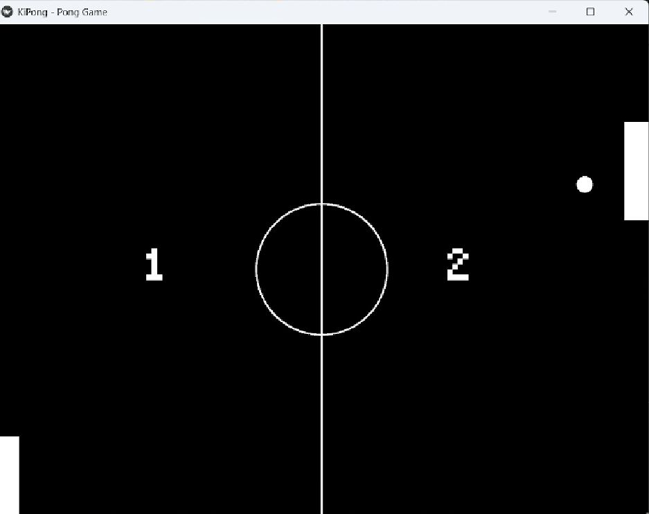
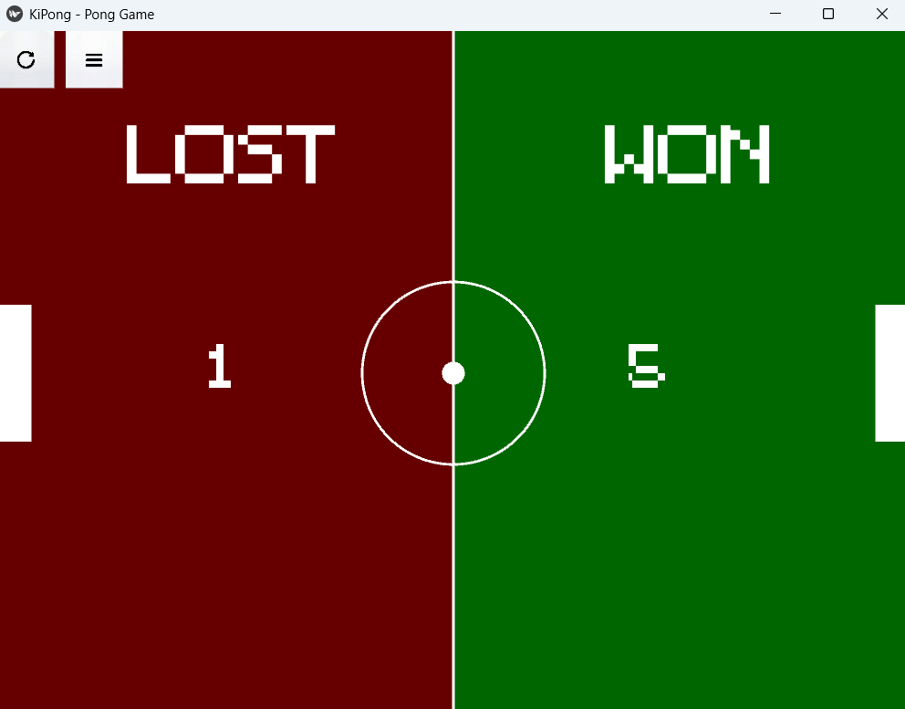

# KiPong
KiPong is a simple recreation of the classic Pong Game made by Atari, Inc. in 1972. 

## Images




## How to play the game

### Prerequisites 
- Python: Any `python` version above python `3.11` would be preferred
- Pip : `Pip` is needed to handle and install kivy's dependencies
- Graphics: Need a GPU with atleast `OpenGL (ES) 2.0+` to render the UI. For `Non-GPU` users you can use Mesa 3D for `Linux` or the `ANGLE` backend for Windows

### How to Run 
1 **Running main.py:** 
  - Clone the project into your machine and enter the directory
  ```bash
    git clone https://github.com/Debag101/KiPong.git
    cd KiPong  
  ```
  - Install dependencies
  ```bash
    pip install -r requirements.txt
  ```
  - Run main.py
  ```bash
    python main.py
  ```
2 **Running exe:** 
  - Navigate to the releases page
  - Install KiPong.exe
  - Run the exe

### Controls
**Player 1 (Left)**
  - Up: W
  - Down: S
**Player 2(Right)**
  - Up: I
  - Down: J

## Components:
Made in [Python](https://www.python.org/) and kivylang using the open source, cross platform UI library, [Kivy 2.3.1](https://kivy.org/)


