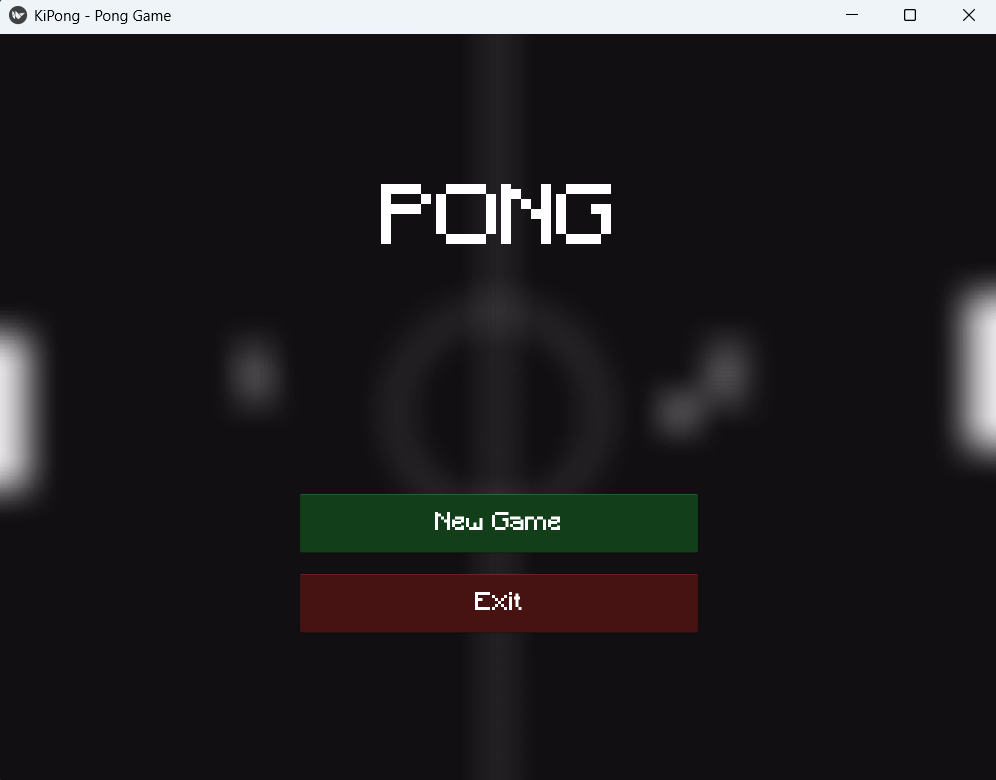

# KiPong
The classic pong game made in python using the Kivy UI Library. 

## Key Features
- Local Multiplayer: Compete head-to-head on the same keyboard.
- Simple physics : My best attempt at simulating collisions and kinematics.
- Loading Screen: Features a looping video background on the start screen and buttons.
- Audio: Tried adding impact audio using the `SoundLoader` module inbuilt in kivy.
- Game Over Screen: Color coded overlays indicating WIN/LOSE status with Kivy `Animation`.

  
## Images


## Getting Started
### Prerequisties 
Make sure you have python installed on your system (preferably Python 3.12+)

### Installation
1. **Clone The Repository**
   ```bash
   git clone https://github.com/Debag101/KiPong.git
   cd KiPong
   ```
2. **Create a Virtual Environment (Preferable)**
   ```bash
   python -m venv venv
   source venv/bin/activate # On Windows use `venv\Scripts\activate
   ```
3. **Install dependencies**
   ```bash
   pip install -r requirements.txt
   ```
## How To Play

Run the main game script from the `src` directory:
```bash
cd src
python main.py
```

### Controls
| Action | Player 1 (Left) | Player 2 (Right) |
| :--- | :---: | :---: |
| **Move Up** | `W` | `I` |
| **Move Down** | `S` | `J` |


## Project Structure
```text
KiPong/
├── design/
│   ├── game_screen.kv
│   ├── loading_screen.kv
│   └── style.kv
├── resources/
│   ├── audio/        # Bounce and victory sounds
│   ├── buttons/      # Custom UI sprites
│   ├── fonts/        # Minecraft.ttf
│   └── video/        # PongBg.mp4
├── src/
│   ├── main.py
│   └── screens/
│       └── game_screen.py
└── requirements.txt
```

## Built With
* [Python](https://www.python.org/)
* [Kivy 2.3.1](https://kivy.org/)


